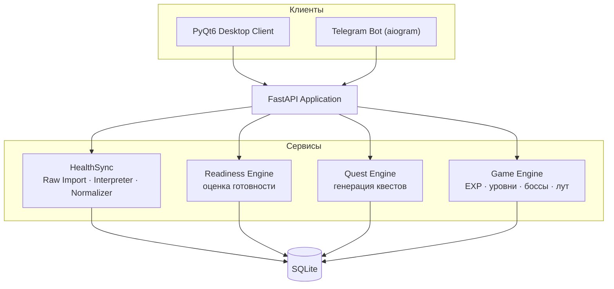
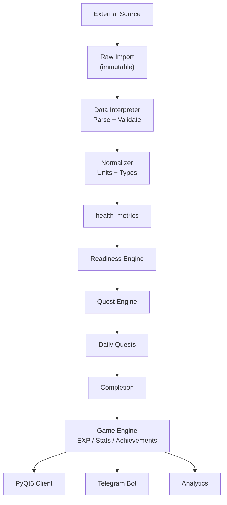

# Архитектура Ascend

> Подробное ТЗ см. в [`specs.md`](../specs.md). Этот документ описывает
> архитектурное устройство системы на уровне Sprint 0.

## 1. Обзор

Ascend — **local-first** приложение: основные данные хранятся локально в SQLite,
а FastAPI работает как локальный сервер. PyQt6 Desktop Client — основной
интерфейс, Telegram Bot — дополнительный канал.



## 2. Ключевые принципы

### 2.1. Local-first

- Все данные — в локальном SQLite.
- Облачный сервер не требуется для основной работы.
- Интернет нужен только для Telegram Bot.

```
Desktop Client → Local FastAPI → SQLite
```

### 2.2. Разделение исходных и обработанных данных

Исходные данные (Raw) **никогда** не зависят от логики интерпретации. Это
позвляет менять алгоритмы без повторной загрузки файлов.

```
Raw Data → Interpreter → Normalized Data → Derived Data → Game Logic
```

### 2.3. Независимость источников

Бизнес-логика не привязана к поставщику данных. Каждый источник реализуется
как отдельный adapter/importer, приводящий данные к общей модели.

```
AppleHealthAdapter ─┐
GarminAdapter ──────┼──→ Common Health Model → health_metrics
StravaAdapter ──────┤
CSVAdapter ─────────┘
```

### 2.4. Offline-first

Без интернета доступны: профиль, квесты, выполнение, прогресс, Readiness,
игровая система, импорт локальных файлов, экспорт, backup.

## 3. Компоненты и зоны ответственности

| Модуль            | Зона ответственности                       | Спринт |
|-------------------|--------------------------------------------|--------|
| **HealthSync**    | данные: импорт, интерпретация, нормализация | 3      |
| **Readiness Engine** | состояние: оценка готовности к нагрузке  | 4      |
| **Quest Engine**  | тренировки: генерация и адаптация квестов  | 5      |
| **Game Engine**   | игровой прогресс: EXP, уровни, боссы, лут  | 6      |
| **API**           | доступ к системе (FastAPI)                 | 1+     |
| **PyQt6 / Telegram** | интерфейс пользователя                  | 7–8    |

> UI не должен самостоятельно рассчитывать EXP, Readiness или сложность
> квестов — вся логика на backend.

## 4. Жизненный цикл данных



## 5. Идемпотентность и перепроцессинг

- **Идемпотентность импорта**: повторная загрузка файла определяется по
  `file_hash` (SHA-256) и не создаёт дубликатов.
- **Перепроцессинг**: существующий Raw Import можно повторно интерпретировать
  новой версией алгоритма — метрики обновляются, raw-данные сохраняются.

```
Raw Import → Interpreter v1 → Metrics
         → Interpreter v2 → Metrics (обновлены)
```

## 6. Хранилище данных

SQLite — единственное хранилище. Схема из 19 таблиц описана в
[`er-diagram.md`](er-diagram.md). Группы таблиц:

- **Аккаунты**: `users`, `profiles`
- **HealthSync**: `metric_definitions`, `raw_health_imports`, `health_metrics`, `sync_logs`
- **Упражнения/калибровка**: `exercises`, `calibration_records`
- **Квесты**: `quest_templates`, `daily_quests`, `quest_completions`
- **Готовность**: `readiness_scores`
- **Игра**: `bosses`, `achievements`, `user_achievements`, `items`, `lootboxes`, `lootbox_rewards`, `user_inventory`

## 7. Конфигурация

Все параметры баланса вынесены в конфигурацию (`app/core/config.py` + `.env`),
а не захардкожены в бизнес-логику (раздел 57 ТЗ):

- `EXP_BASE`, `LEVEL_MULTIPLIER`, `EXP_MULTIPLIER`
- `READINESS_WEIGHTS`, `LOW_READINESS_THRESHOLD`, `RECOVERY_THRESHOLD`
- `QUEST_DIFFICULTY_MODIFIERS`

Секреты (`SECRET_KEY`, `TELEGRAM_BOT_TOKEN`) хранятся **только** в окружении,
никогда в БД.

## 8. Версионирование алгоритмов

Алгоритмы Interpreter, Readiness, Quest Generator, EXP должны иметь версии
(раздел 73 ТЗ) — для анализа истории и повторного расчёта. Версии будут
храниться вместе с результатами (поле версии добавляется в соответствующих
таблицах в Sprint 3–6).

## 9. Структура проекта

```
ascend/
├── backend/
│   ├── app/
│   │   ├── api/          # FastAPI роутеры
│   │   ├── core/         # конфигурация, безопасность
│   │   ├── db/           # engine, session, Base
│   │   ├── models/       # SQLAlchemy ORM-модели
│   │   ├── schemas/      # Pydantic-схемы API
│   │   ├── services/     # бизнес-логика (healthsync, readiness, quests, game)
│   │   └── main.py       # точка входа FastAPI
│   └── tests/
├── desktop/              # PyQt6 клиент (Sprint 7)
├── telegram/             # aiogram бот (Sprint 8)
├── migrations/           # Alembic (Sprint 1)
├── docs/                 # архитектура, ER, API-контракт
├── exports/              # экспорт CSV/JSON
├── backups/              # .ascend-backup
├── pyproject.toml
└── .env.example
```