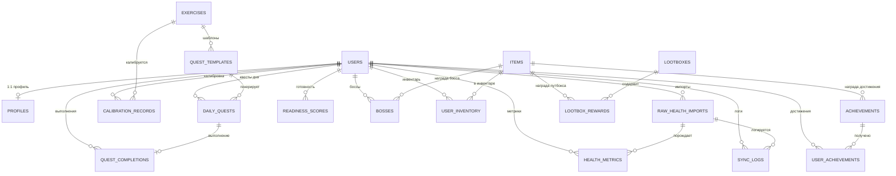
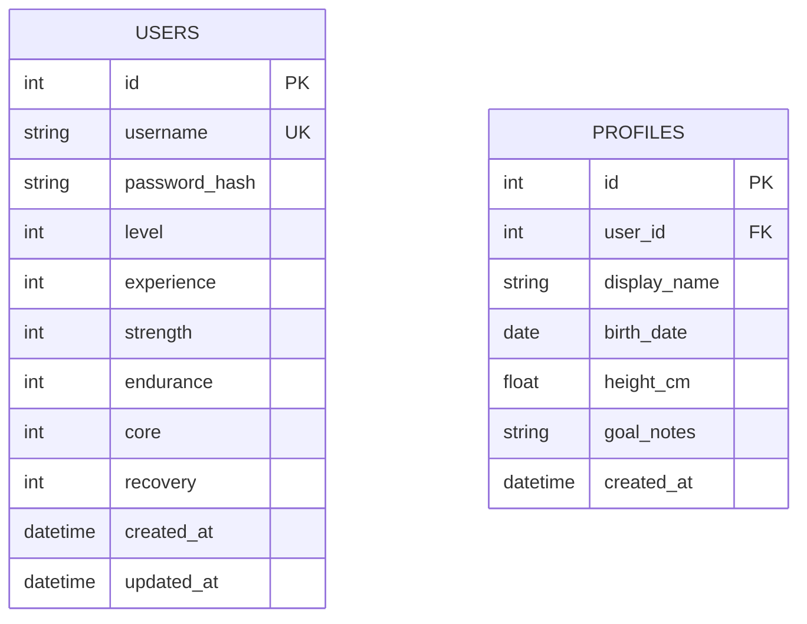
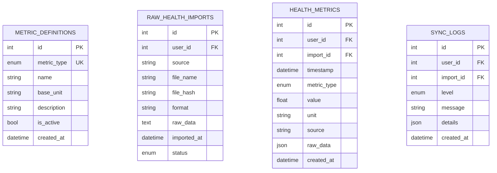
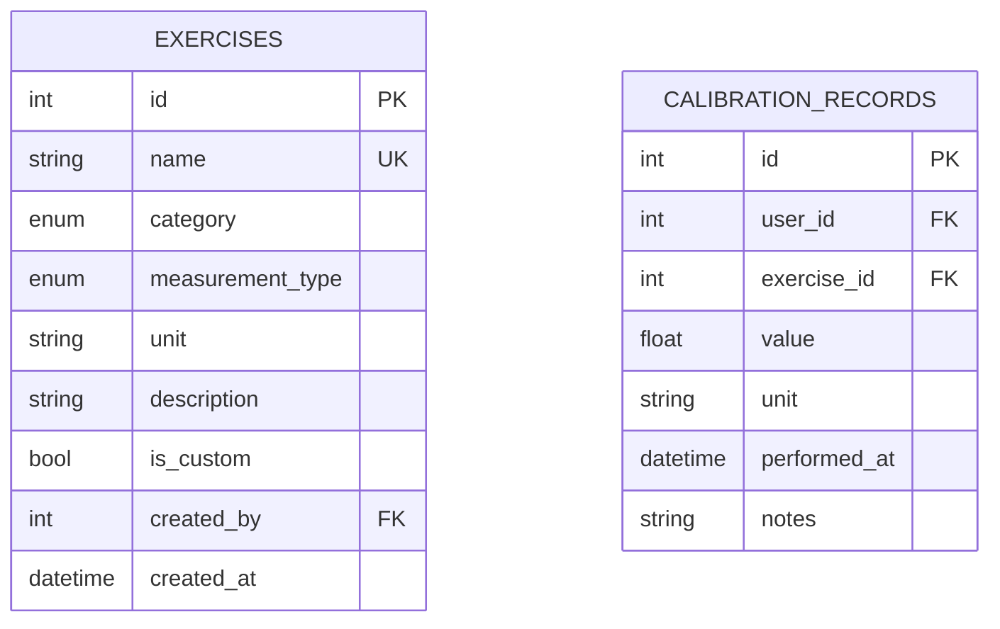
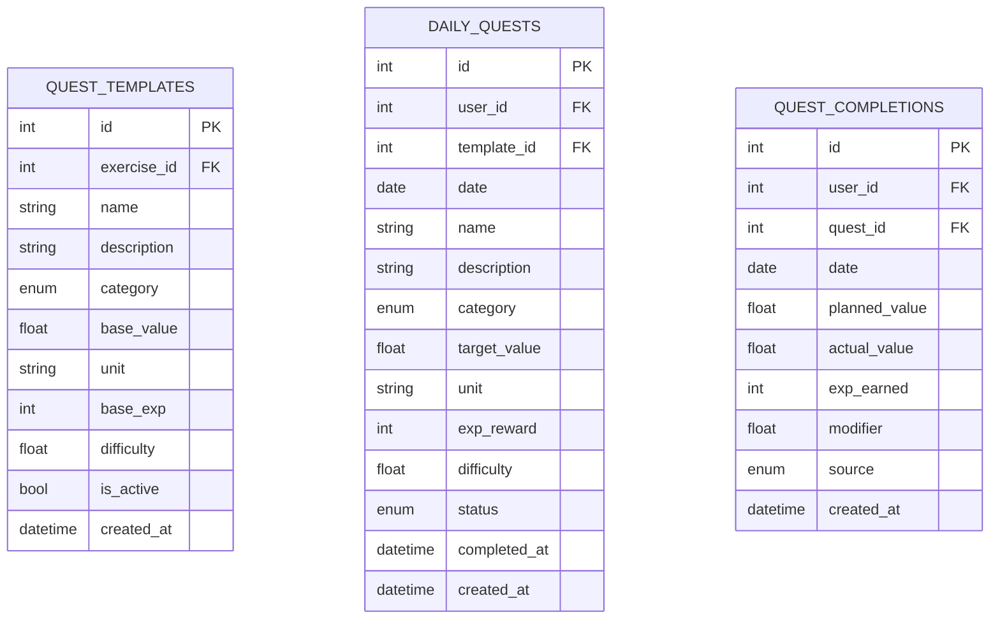
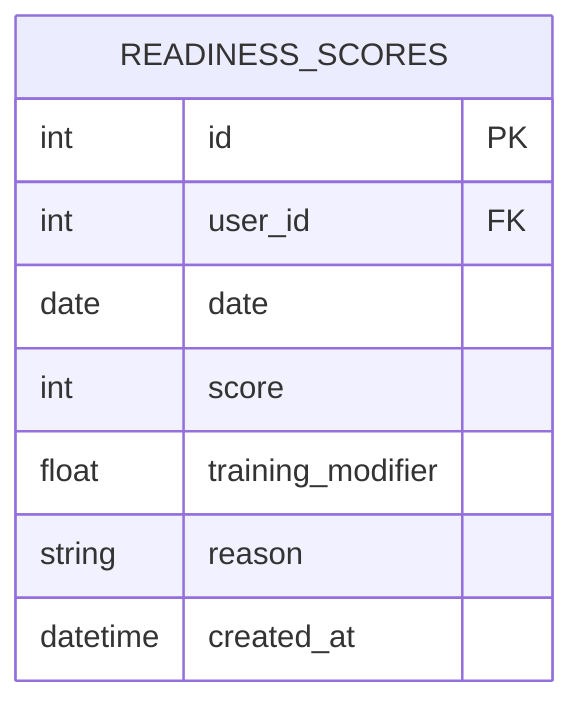
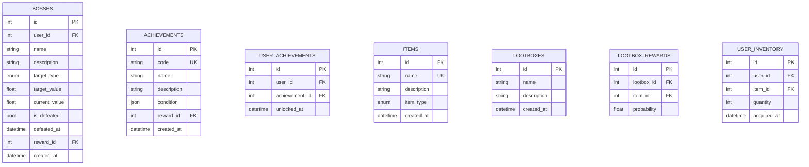

# ER-диаграмма Ascend

> Полный текст ТЗ — в [`specs.md`](../specs.md). Диаграмма отражает схему
> из 19 таблиц, реализованную в Sprint 0 (`backend/app/models/`).

## Диаграмма связей

## Схемы таблиц

### Аккаунты

### HealthSync

### Упражнения и калибровка

### Квесты

### Готовность

### Игра

## Инвентарь таблиц

| # | Таблица               | Спринт | Назначение                              |
|---|-----------------------|--------|-----------------------------------------|
| 1 | `users`               | 1      | Аккаунт + игровые характеристики        |
| 2 | `profiles`            | 1      | Персональные данные (1:1 к users)       |
| 3 | `metric_definitions`  | 3      | Справочник метрик и единиц              |
| 4 | `raw_health_imports`  | 3      | Неизменяемые исходные импорты           |
| 5 | `health_metrics`      | 3      | Нормализованные метрики                 |
| 6 | `sync_logs`           | 3      | Логи синхронизации                      |
| 7 | `exercises`           | 2      | Упражнения (встроенные и custom)        |
| 8 | `calibration_records` | 2      | Результаты калибровочных тестов         |
| 9 | `quest_templates`     | 5      | Шаблоны заданий                         |
| 10| `daily_quests`        | 5      | Сгенерированные квесты на день          |
| 11| `quest_completions`   | 5      | Факты выполнения квестов                |
| 12| `readiness_scores`    | 4      | Оценки готовности                       |
| 13| `bosses`              | 6      | Долгосрочные цели                       |
| 14| `achievements`        | 6      | Достижения (определения)                |
| 15| `user_achievements`   | 6      | Полученные достижения                   |
| 16| `items`               | 6      | Игровые предметы/награды                |
| 17| `lootboxes`           | 6      | Лутбоксы                                |
| 18| `lootbox_rewards`     | 6      | Содержимое лутбоксов                    |
| 19| `user_inventory`      | 6      | Инвентарь пользователя                  |

## Ключевые ограничения целостности

- `raw_health_imports`: `UNIQUE(user_id, file_hash)` — идемпотентность импорта.
- `readiness_scores`: `UNIQUE(user_id, date)` — одна оценка в день.
- `daily_quests`: `UNIQUE(user_id, date, template_id)` — без дублей квестов.
- `user_achievements`: `UNIQUE(user_id, achievement_id)` — без дублей наград.
- `user_inventory`: `UNIQUE(user_id, item_id)` — стекинг предметов.
- `health_metrics`: индексы `(user_id, timestamp)`, `(user_id, metric_type, timestamp)`, `(metric_type)`, `(import_id)`.